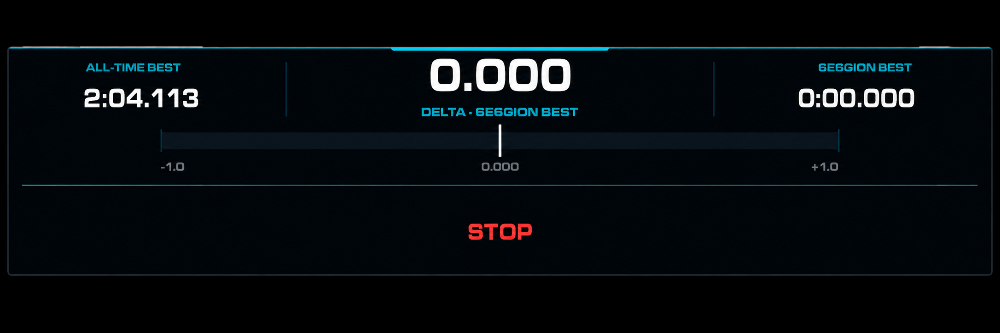
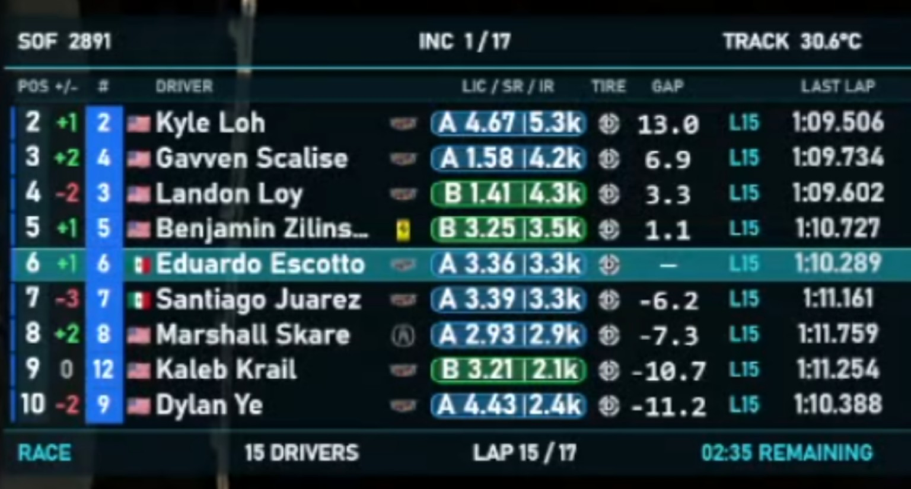
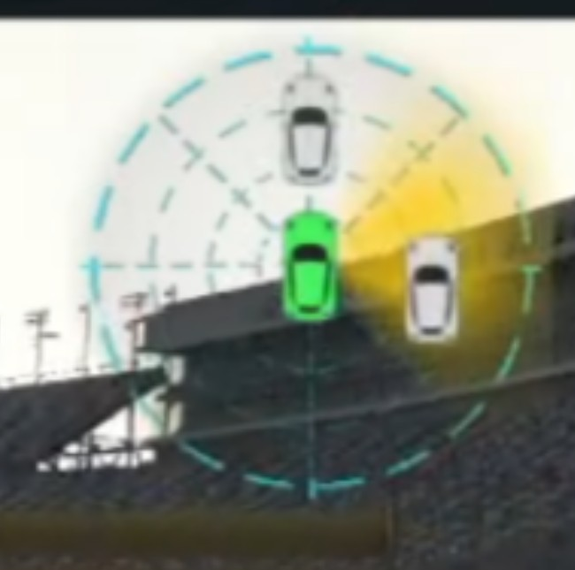
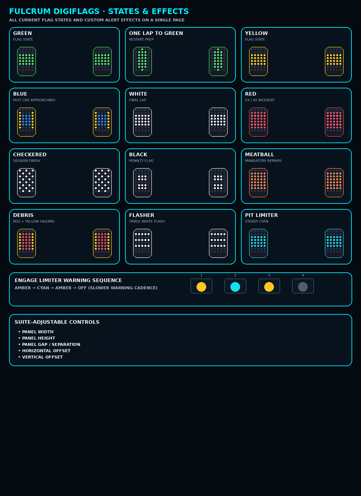

  

<h1 align="center">Fulcrum Suite</h1>

  Free SimHub overlay suite for iRacing

  <a href="https://github.com/fulcrumttv/Fulcrum-Suite/releases/latest">
    Download Latest Release
  </a>
  •
  <a href="Fulcrum_Suite_Guide_EN.pdf">
    English Guide
  </a>
  •
  <a href="Fulcrum_Suite_Guia_ES.pdf">
    Guía en Español
  </a>

# Fulcrum Suite

Free SimHub overlay suite for iRacing — timing, relatives, radar, strategy, DigiFlags and more.

Fulcrum Suite is a free collection of SimHub overlays designed to improve race awareness, timing, strategy and in-car information while keeping a consistent Fulcrum visual style.

## Preview

  

  

  

  

## Included Overlays

- Fulcrum Conditions
- Fulcrum Delta
- Fulcrum DigiFlags
- Fulcrum Pit Assistant
- Fulcrum Radar
- Fulcrum Rejoin Assistant
- Fulcrum Relatives
- Fulcrum Sectors Pop-Up
- Fulcrum Sectors Table
- Fulcrum Strategy Engineer
- Fulcrum Systems
- Fulcrum Wind

## Highlights

- Selectable timing reference:
  - **MY BEST LAP**
  - **CLASS SESSION BEST**
- Shared timing reference across:
  - Fulcrum Delta
  - Sectors Pop-Up
  - Sectors Table
- Class-aware timing and multiclass support
- Direct EST GAP behavior in Fulcrum Relatives
- Sports / Formula Radar modes
- Configurable Relatives columns, widths and layout
- Configurable DigiFlags positioning, size, brightness and alert behavior
- Pit limiter and engage-limiter warnings
- Race flag animations
- Incident alerts
- Rejoin traffic assistance
- Fuel and stint strategy tools
- Environmental and wind information

## Installation

1. Download the latest Fulcrum Suite release.
2. Close SimHub.
3. Copy:
   - `Fulcrum.Plugin.dll`
   - `Fulcrum.Core.dll`

   into your SimHub installation folder:

   `C:\Program Files (x86)\SimHub\`

4. Open SimHub.
5. Go to **Add/remove features**.
6. Make sure **Fulcrum Suite** is enabled.
7. Enable **Show in left main menu**.
8. Open the `Overlays` folder included with the release.
9. Import the `.simhubdash` files you want to use.
10. Confirm the overlays appear under **Dash Studio > Overlays**.

## Timing Reference

Fulcrum Suite includes a global timing reference selector.

### MY BEST LAP
Uses your fastest valid personal lap in the current session.

### CLASS SESSION BEST
Uses the fastest valid lap set by a driver in your class.

This option affects:

- Fulcrum Delta
- Fulcrum Sectors Pop-Up
- Fulcrum Sectors Table

Fulcrum Relative GAP is not affected by this setting.

## Customization

### DigiFlags

Fulcrum DigiFlags can be configured directly from Fulcrum Suite:

- Enable / disable DigiFlags
- Preview panels while configuring
- Panel spacing
- Panel width
- Panel height
- Horizontal offset
- Vertical offset
- Brightness
- Incident alert hold
- Auto-hide when no active signal

### Relatives

Fulcrum Relatives includes configurable:

- Position
- Position gain / loss
- Car number
- Country flags
- Driver
- Manufacturer logo
- License / Safety Rating / iRating
- Tire compound
- Overtake / Push-to-Pass
- Live GAP
- Status / stint
- Last lap

Column widths and visibility can be adjusted from Fulcrum Suite.

### Radar

Fulcrum Radar supports:

- **Sports mode**
- **Formula mode**

## Documentation

- [English Guide](Fulcrum_Suite_Guide_EN.pdf)
- [Guía en Español](Fulcrum_Suite_Guia_ES.pdf)

## Requirements

- Windows
- SimHub
- iRacing

## Beta Notice

Fulcrum Suite is currently in public beta.

Feedback and bug reports are welcome.

## Support FulcrumTTV

Fulcrum Suite is completely free.

If you enjoy the project and would like to support its continued development, testing and future updates, you can support FulcrumTTV here:

[Support FulcrumTTV via PayPal](https://www.paypal.com/ncp/payment/UQBY2U4HL2RDN)

Thank you for supporting the project.

## Follow FulcrumTTV

## Follow FulcrumTTV

- [YouTube](https://youtube.com/@fulcrumttv)
- [Twitch](https://www.twitch.tv/fulcrumttv)
- [TikTok](https://www.tiktok.com/@fulcrumttv)
- [Instagram](https://www.instagram.com/fulcrumttv)

## Acknowledgements

Special thanks to:

- **SimHub** — for providing an incredibly powerful and free platform that makes projects like Fulcrum Suite possible.
- **BenOfficial2** — for the inspiration that helped shape some of the ideas behind Fulcrum Suite.

Fulcrum Suite is an independent project and is not affiliated with or endorsed by SimHub or BenOfficial2.
